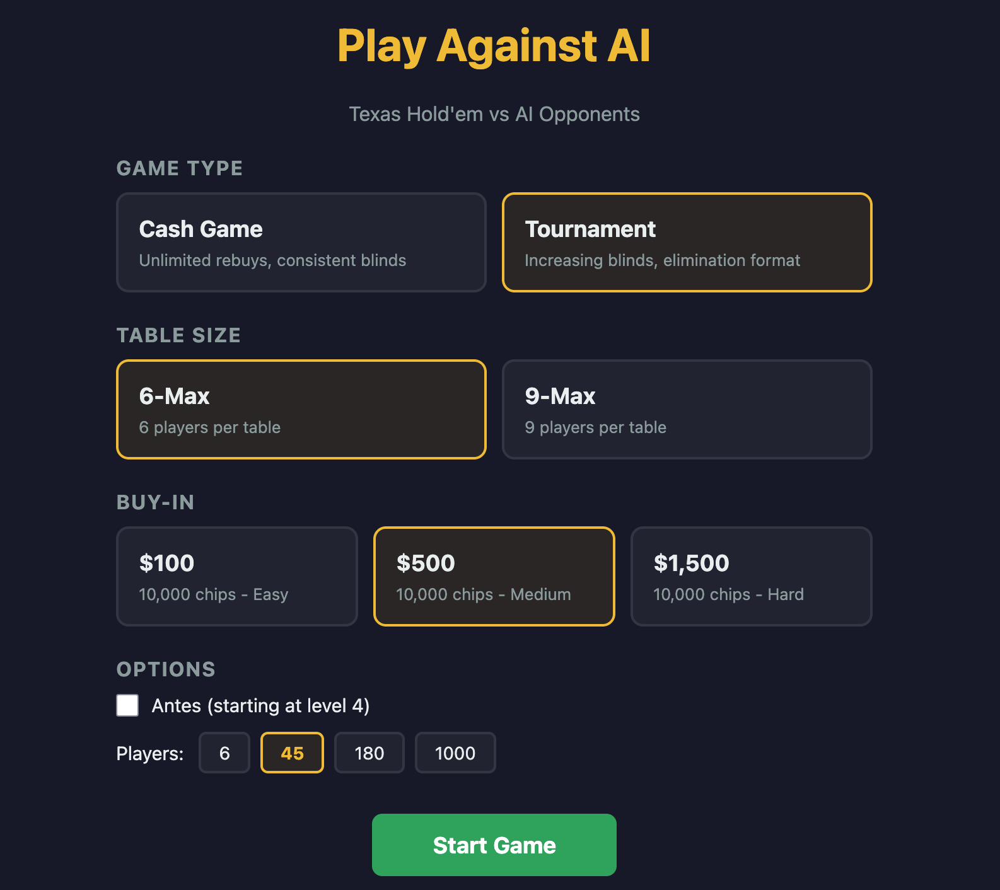
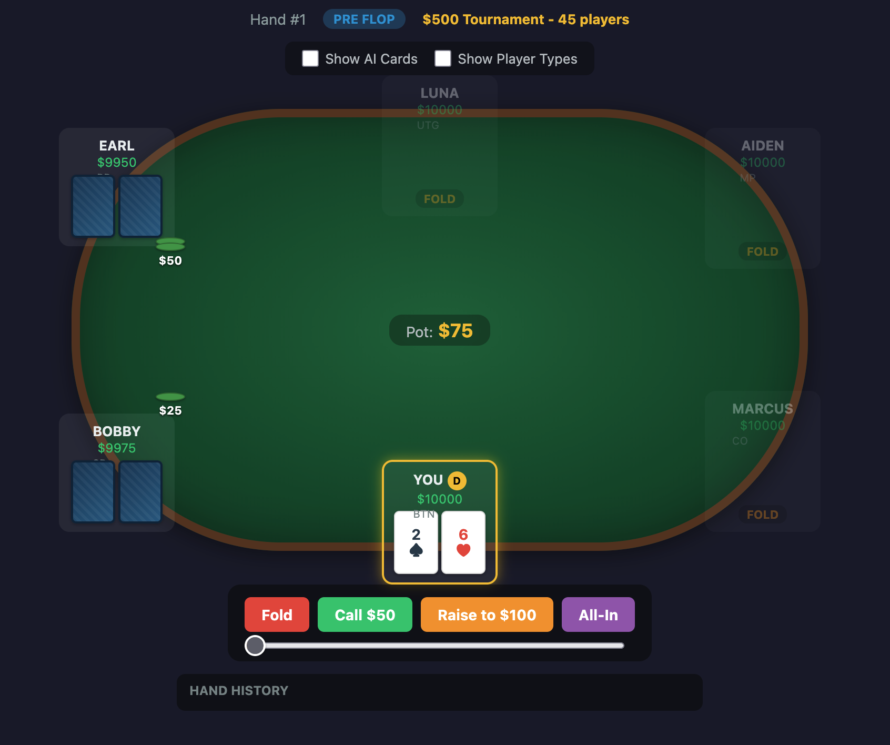

# Play Against AI

A Texas Hold'em poker trainer. Play against AI opponents with distinct play styles (TAG, LAG, Calling Station, Nit, Shark) powered by an LLM for post-flop decisions.

## Screenshots





## Prerequisites

- Java 21
- Node.js 22+
- [Ollama](https://ollama.ai) with the `llama3.1:8b` model pulled (`ollama pull llama3.1:8b`)

## Quick Start

### 1. Start Ollama

```sh
ollama serve
```

### 2. Start the backend

```sh
cd backend
./gradlew run
```

The Ktor server starts on http://localhost:8080.

### 3. Start the frontend

```sh
cd frontend
npm install
npm run dev
```

The Vite dev server starts on http://localhost:5173.

### 4. Play

Open http://localhost:5173 in your browser.

## Running Tests

```sh
cd backend
./gradlew test
```

## Project Structure

```
backend/   - Kotlin + Ktor server (WebSocket game engine, AI decision-making)
frontend/  - React + TypeScript UI (Vite)
```
